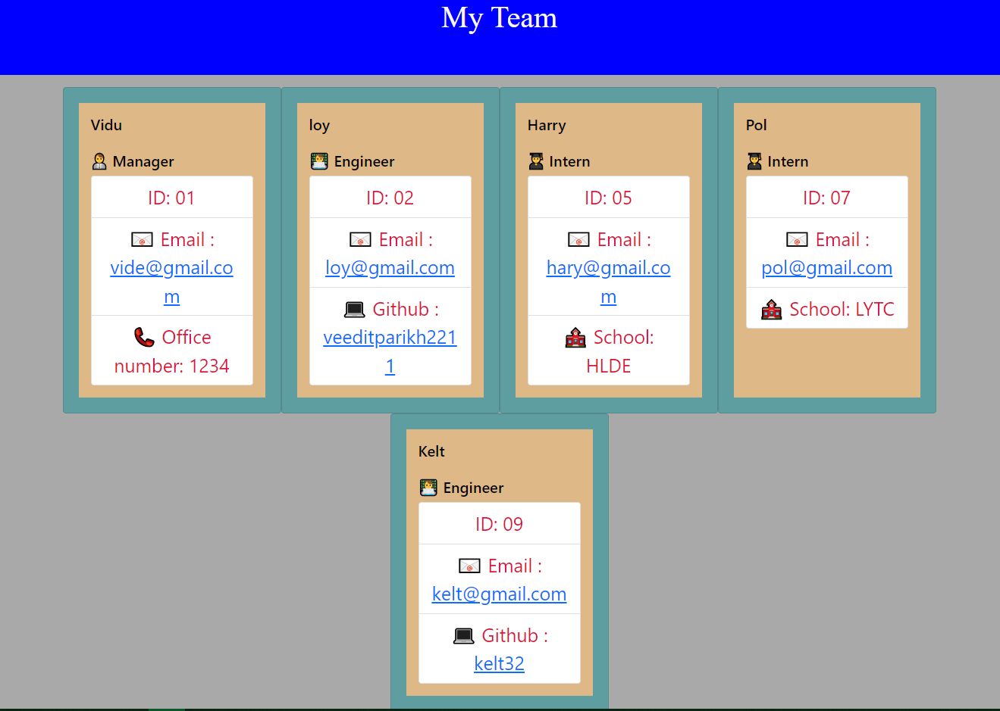

# Team-Profile-Generator

Node.js to build a Html page to display the team with different input values.
## Purpose

Team Profile Generator is used to generate the team with the use of inquirer to collect the information input by the user and running the unit test with the help of Jest dependency.
## Built With

Node
CSS
Bootstrap
Jest

## Website

https://veeditparikh2211.github.io/Team-Profile-Generator/

## Application

## Video

## Contribution

Made by Veedit Parikh